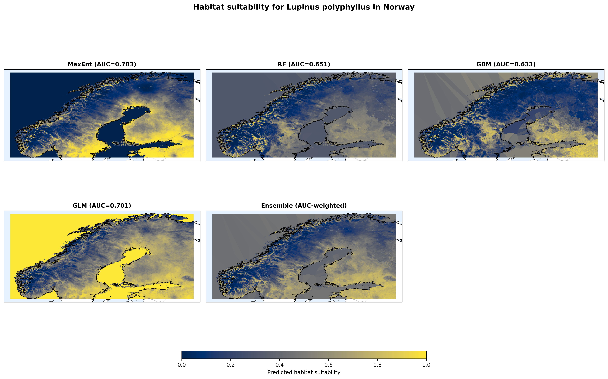
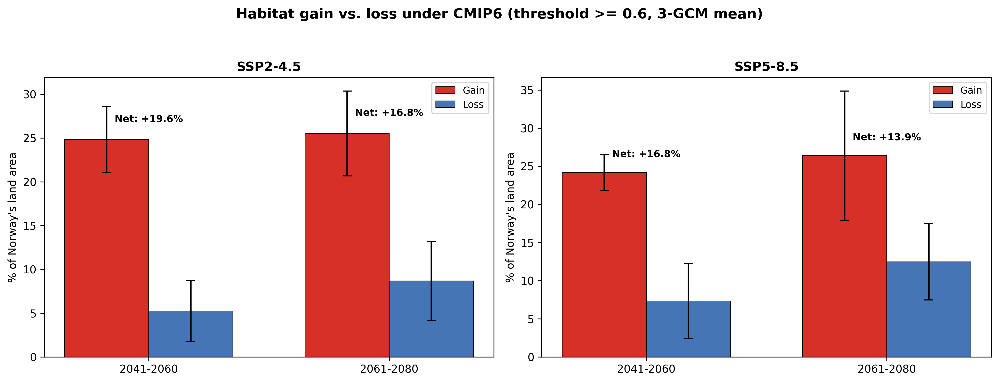

# Ensemble Species Distribution Model — Invasive Garden Lupin in Norway

> A reproducible Python pipeline that forecasts climatically suitable habitat for *Lupinus polyphyllus* (garden lupin) across Norway under current and CMIP6 future climate scenarios, using a four-algorithm ensemble with spatial cross-validation and uncertainty quantification.



---

## TL;DR

| | |
|---|---|
| **Question** | Where in Norway is the invasive garden lupin climatically suitable today, and how will that change by 2080? |
| **Approach** | Ensemble of MaxEnt + Random Forest + Gradient Boosting + Logistic Regression, AUC-weighted |
| **Validation** | 4-fold geographic cross-validation + corrected Boyce index + inter-algorithm SD |
| **Data** | 15,350 GBIF presences • 10,000 KDE-weighted background points • 10 bioclimatic / edaphic predictors • 3 CMIP6 GCMs × 2 SSPs × 2 periods |
| **Headline finding** | Under SSP5-8.5 (2061–2080), *net* habitat expands **+14%** — not more, because trailing-edge losses in southern Norway double (5% → 13%) as temperatures exceed the species' thermal optimum |
| **Code** | Single reproducible script + companion Jupyter notebook |

---

## Why this project exists

This is a portfolio piece demonstrating a complete, reproducible geospatial machine-learning pipeline — from raw GBIF occurrence records to management-relevant uncertainty-aware risk maps.

Concretely it shows competence in:

- **Geospatial data engineering** (GBIF API, WorldClim, CMIP6, SoilGrids, raster stacking/alignment, multi-resolution handling)
- **Machine learning for structured ecological data** (ensemble modelling, spatial cross-validation, class imbalance handling)
- **Uncertainty quantification** (inter-algorithm SD, out-of-fold permutation importance, MESS extrapolation)
- **Reproducibility** (single-source-of-truth configuration, deterministic seeding, one-command regeneration of all outputs)
- **Scientific communication** (honest reporting of model limitations, narrative notebook, publication-quality figures)

---

## Pipeline

```
GBIF query ─────┐
                ├─► cleaned occurrences ─┐
WorldClim 2.1 ──┤                        │
SoilGrids ──────┤                        ├─► spatial CV ─┐
Copernicus DEM ─┘                        │               │
                                         │               ├─► ensemble ─► current risk map
KDE bias surface ─► 10,000 bg pts ───────┘               │              │
                                                         │              ├─► uncertainty map
CMIP6 (3 GCM × 2 SSP × 2 period) ─► future projections ──┤              │
                                                         │              ├─► gain/loss decomposition
                                                         └─► MESS ──────┘
```

Every step is scripted and seeded (`SEED = 42`). Running `python portfolio_pipeline.py` regenerates every figure and CSV in `data/figures/` and `data/model/`.

---

## Key methodological choices

### Spatial (geographic) cross-validation

Random k-fold leaks information in spatial problems because nearby points share autocorrelated noise. We use `elapid.GeographicKFold` (k-means clustering on lon/lat) with `k = 4`, holding one geographic cluster out per fold.

### Corrected Boyce index

Some SDM implementations compute the Boyce P/E ratio using the proportion of *all* test pixels in a bin as the denominator. The standard (Hirzel et al. 2006) uses **background** as the denominator. We implement the corrected form.

### Out-of-fold permutation importance

Training-set permutation importance over-states predictor influence because the model has already memorised the permuted value. We concatenate out-of-fold predictions — each point is predicted by a model that never saw it — and compute ΔAUC on that held-out set.

### NaN-safe ensemble averaging

The AUC-weighted ensemble uses `nansum(w × pred) / nansum(w × finite_mask)` so edge pixels where one algorithm returned NaN don't get pulled toward zero.

### MESS extrapolation flag

For each pixel we compute the minimum (over 10 predictors) of how far the predictor value is outside the training range. Negative MESS → extrapolation → treat predictions cautiously.

---

## Results highlights

### Algorithm comparison (spatial CV)

| Algorithm | AUC | Boyce |
|---|---|---|
| MaxEnt (LQ, β = 2.0) | **0.703 ± 0.030** | 0.94 ± 0.10 |
| GLM (L2 logistic)     | 0.701 ± 0.022 | **0.98 ± 0.02** |
| Random Forest (500 trees) | 0.651 ± 0.044 | 0.93 ± 0.09 |
| Gradient Boosting (300 × depth 5) | 0.633 ± 0.039 | 0.90 ± 0.06 |

Simpler models (MaxEnt, GLM) **outperform** tree-based learners here — flexible trees over-fit when signal is moderate and presence points are spatially clustered.

### Most influential predictors (out-of-fold ΔAUC)

| Rank | Predictor | ΔAUC |
|---|---|---|
| 1 | Mean T warmest quarter (bio_10) | **0.153** |
| 2 | Precipitation warmest quarter (bio_18) | 0.051 |
| 3 | Isothermality (bio_3) | 0.042 |
| 4 | Precipitation coldest quarter (bio_19) | 0.022 |
| 5 | Mean T wettest quarter (bio_8) | 0.020 |
| 6 | Mean diurnal range (bio_2) | 0.019 |
| 7 | T coldest quarter (bio_11) | 0.016 |
| 8 | Soil pH | 0.003 |
| 9 | Terrain slope | 0.002 |
| 10 | Precipitation seasonality (bio_15) | −0.002 |

Growing-season temperature dominates. Non-climatic predictors (soil pH, slope) contribute almost nothing at the ensemble level — even though Random Forest's Gini importance would rank them highly. This is exactly the kind of discrepancy that algorithm-agnostic permutation importance is designed to catch.

### Future projections — gain / loss decomposition



The counter-intuitive finding: **net expansion shrinks under stronger warming.** Gain is roughly constant across scenarios (~25% of Norway), but losses more than double under SSP5-8.5 by 2080 because southern summer temperatures cross the species' inferred thermal optimum (~14 °C).

---

## Repository layout

```
.
├── portfolio_pipeline.py        # main reproducible pipeline (one script → all figures)
├── notebook.ipynb               # narrative Jupyter walkthrough of the pipeline
├── quicklook.py                 # helper used by notebook Appendix A (any species)
│
├── data_prep/                   # one-off scripts that produce the cached data/
│   ├── download_clean_gbif.py       # GBIF query + dedup + 1-km thinning
│   ├── prepare_env_layers.py        # WorldClim raster stack + collinearity screen
│   ├── prepare_extra_predictors.py  # DEM → slope, SoilGrids soil pH, VIF screen
│   ├── create_background.py         # KDE bias surface + background point sampling
│   ├── retune_expanded.py           # MaxEnt hyperparameter tuning (one-time)
│   ├── ensemble_models.py           # produces occurrence/background_env_expanded.csv
│   ├── future_projections.py        # CMIP6 bioclim download
│   └── ensemble_future.py           # multi-algorithm future projection rasters
│
├── data/
│   ├── env_layers/              # WorldClim + slope + soil_ph rasters
│   ├── future/                  # CMIP6 rasters + ensemble future projections
│   ├── figures/                 # 12 portfolio figures (regenerated by pipeline)
│   └── model/                   # fitted models, CV results, summary tables
│
├── requirements.txt
├── .gitignore
├── README.md
└── LINKEDIN_POST.md             # draft launch sequence
```

**Use the root scripts for normal viewing/running.** The `data_prep/` folder only needs to run if you want to regenerate everything from raw GBIF + WorldClim + CMIP6 downloads (several hours).

---

## Reproducing

```bash
# 1. Environment
python -m venv venv
venv\Scripts\activate            # or: source venv/bin/activate
pip install -r requirements.txt

# 2. (Optional) regenerate raw data — takes hours and requires internet
python data_prep/download_clean_gbif.py
python data_prep/prepare_env_layers.py
python data_prep/prepare_extra_predictors.py
python data_prep/create_background.py
python data_prep/ensemble_models.py      # produces *_expanded.csv
python data_prep/future_projections.py   # CMIP6 download (~3 GB)
python data_prep/ensemble_future.py      # future ensemble rasters

# 3. Run the full modelling pipeline (re-generates everything in data/figures/)
python portfolio_pipeline.py

# or open the notebook walkthrough
jupyter lab notebook.ipynb
```

With cached intermediate data in `data/`, step 3 completes in ~15 minutes on a consumer laptop (8 cores).

---

## Appendix A — Try it on your own Norwegian invasive

The notebook includes an appendix that lets you run a fast (~3–5 min) version of the pipeline on **any GBIF-listed species in Norway**. Helper module: `quicklook.py`.

```python
from quicklook import run_quicklook
result = run_quicklook("Heracleum mantegazzianum", country="NO")
```

Does GBIF download + cleaning + spatial CV + ensemble (MaxEnt + GLM) + map render. Guardrails for sparse species (≥ 200 records required). Skips RF/GBM/CMIP6/MESS for speed; use the full `portfolio_pipeline.py` if you want those.

---

## Honest limitations

- **Moderate discrimination** (AUC ≈ 0.70). Reasonable for a presence-only invasive SDM with ~15k occurrences, but specific pixel-level predictions carry substantial uncertainty — use the ensemble mean together with the SD map.
- **No dispersal or land-use predictors.** The maps describe the *climatic* envelope, not where the species will actually reach by a given year. Road density data (not included) would likely improve local predictions for a corridor-dispersing species.
- **Niche equilibrium assumption violated.** *L. polyphyllus* is actively invading — the occurrences don't represent a species at equilibrium with climate. All correlative SDMs assume equilibrium; this one is no exception.
- **~40% of Norway lies outside the training envelope (MESS < 0).** Predictions in those pixels (mostly high-elevation interior and far north) are extrapolations.
- **Sampling bias is corrected with a KDE weighting, not eliminated.** Target-group background sampling would be more rigorous.

---

## License

Code: MIT. Data and figures: CC-BY 4.0 (attribution to the upstream data providers listed above).

## Author

**Hesam Ameri** — MSc Sustainability Management · Quantitative Researcher · [LinkedIn](https://www.linkedin.com/in/hesam-ameri-9bb850135/)
